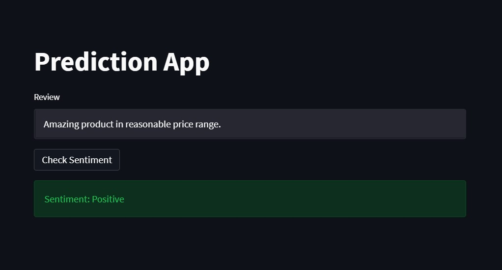
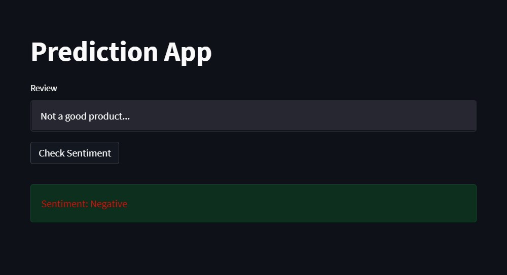

# Feedback Prediction System 2.0
  
### It aims to  
   - develop a mobile application 
   - develop a RestApi to perform api tasks
   - do text cleaning and segmentation
   - do sentiment analysis and provides feedback based on users' verbal reviews.

   We would like to express our special appreciation and thanks to our mentor Pranjal Mangal, you have been helping us
   throughout progress of this project. 

---

## Mobile Application
   
   It is developed with flutter so it can be used on android devices as well as ios devices.

   ### The mobile app 
   - records users' verbal reviews, 
   - transcribe them into text using the google-speech cloud service, and 
   - save them to the database using the RestApi.
   
   ### dependencies:  
   ``` 
   cupertino_icons: ^1.0.2  
   flutter_sound: ^9.1.7  
   google_speech: ^2.0.1  
   permission_handler: ^9.2.0   
   path_provider: ^2.0.9  
   build_runner: ^2.1.8  
   json_annotation: ^4.4.0  
   json_serializable: ^6.1.5  
   dropdown_button2: ^1.4.0  
   ```
   
   Google Speech  
   - to use goole speech service, credential for this service needed.  
   - location of credential for this app is in assets folder in the parent directory of this app  

   ### Working
   - from dropdown list select a product
   - Enter the visitor name
   - Start the recording with button "START"
   - After completion of speech stop the recording with button "STOP".
      
   After stoping the recording app automatically will convert the speech to text and send to remote database.

---

## Backend
   A RestAPI made with django web-app, Django Rest Framework and a relational database.

   dependencies: 
   ```
   python==3.9.x
   config==0.5.1
   Django==3.2.13
   djangorestframework==3.13.1
   mysqlclient==2.1.0
   python-decouple==3.6
   ```
---

## Web Application
   It is made using Streamlit to check sentiment of a review.

   - Positive sentiment

      

   - Negative sentiment

      

## ML model development
   The goal is to performed text pre-processing and design and model ML algorithms to determine the sentiment polarity of reviews.

### Data cleaning and segmentation:
   - Removed stop words by using nltk library  
   Words like pronouns, preposition,.. have no impact.

   - Lemmatize  
   Grouped the inflected forms of a word in order to analyze them as a single word in linguistics.

### Model training
* Logistic Regression

                    precision    recall  f1-score   support

               0       0.89      0.93      0.91      1350
               1       0.94      0.90      0.92      1585

         accuracy                          0.92      2935
         macro avg     0.92      0.92      0.92      2935
      weighted avg     0.92      0.92      0.92      2935  

* Random Forest Classifier

                     precision    recall  f1-score   support

               0       0.84      0.94      0.89      1350
               1       0.95      0.85      0.89      1585

         accuracy                          0.89      2935
         macro avg     0.89      0.90      0.89      2935
      weighted avg     0.90      0.89      0.89      2935  


* Support Vector Machine(SVM)

                    precision    recall  f1-score   support

               0       0.90      0.94      0.92      1350
               1       0.95      0.91      0.93      1585

         accuracy                          0.92      2935
         macro avg     0.92      0.93      0.92      2935
      weighted avg     0.92      0.92      0.92      2935  

  The maximum accuracy of 92% with logistic regression and SVM.
---


   

   

